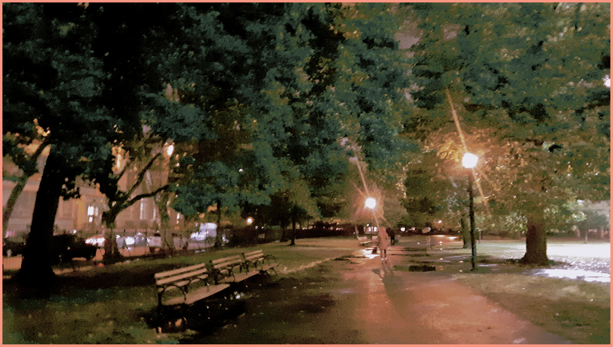

<h1 align="center">Hi I am **ostap-tymur-tymchenko**, and im open for jobs!   </h1>
  
<!-- 
&nbsp;
 -->

<h3 align="center">I am a backend, linux, and (half?) stack dev from Ukraine</h3>

<h5 align="center">

I’m currently working on [AOC 2022](https://github.com/ostap-tymchenko/advent-of-code-2022)

🌱 I’m currently learning **Rust** and more

<!-- All of my projects are available here -->

reach me at  **ostap.tymchenko@gmail.com**

Im looking for work! here is my [resume](https://docs.google.com/document/d/1jceeBEjBIUUgk_26mscVEXBGNuOi5prxM-1p99DCs2M/edit#heading=h.5rf9wr4r3no2)
</h5>
